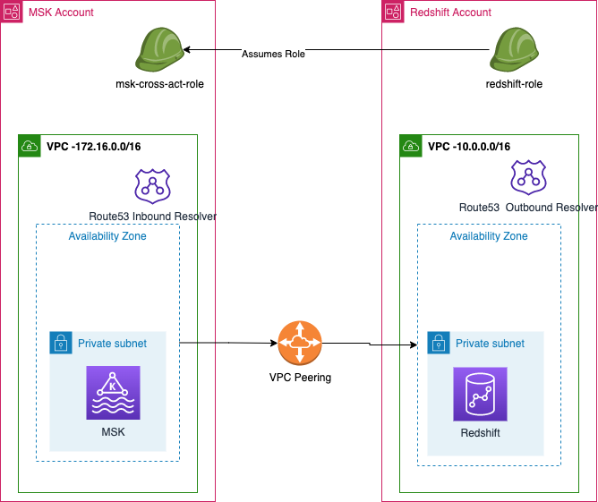
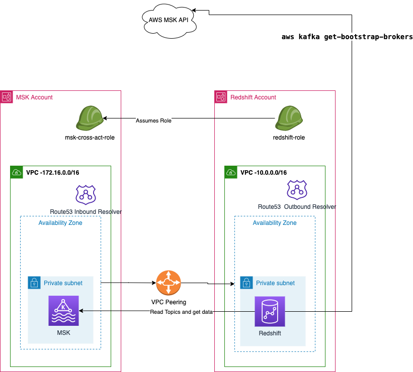

# Solution Overview

The highlight of this architecture are -
1. Redshift is hosted in a DWH account which has tight security control. The VPC in which Redshift is hosted is in 
private subnet and can not access internet. 
2. MSK is hosted in a separate account where workload related to webservices are hosted. The MSK cluster gets 
ClickStream data from applications. The data needs to be ingested and analyzed in Redshift. MSK is hosted in private subnet and can not access public internet.

For this document  Redshift serverlss and MSK serverless are used. 
## Redshift Serverless with MSK serverless
Following diagram shows the high level architecture of the solution -




# Redshift Serverless with MSK serverless
## High Level Steps
1. Steps in MSK account -
   1. Create a security group for MSK serverless cluster and a security group for MSK client which could publish data to the MSK cluster.
   2. Create MSK Serverless cluster in private subnet using the cluster security group created above. 
   3. Create an IAM role which has permission to describe cluster, describe consumer group,  describe/list topics and publish/consume data on the cluster created above. This will be referred as MSK streaming ingestion role. 
2. Steps in Redshift account
   1. Create an IAM role trusted by  "redshift.amazonaws.com". Ensure that the role has permission to assume the MSK streaming ingestion role created above.  
   2. Create a security group ensuring the outbound rule allow communication to STS and MSK public services and MSK cluster created above. 
   3. Create Redshift serverless namespace and workgroup. Use the redshift IAM role created above while creating the namespace. While creating the workgroup use the security group created above and configure private subnet which is attached to NAT GW.
3. Create VPC peering connection between MSK account VPC and Redshift account VPC so that Redshift can communicate with MSK VPC over private network. Update route tables of private subnets of both VPCs to allow connection to the peered VPC.
4. Create Route53 Inbound resolver in MSK account with a Security group that allows inbound connection on port 53 (both UDP/TCP) from the VPC CIDR range of Redshift account created above. 
5. Create Route53 Outbound resolver in Redshift account with Security group that allows inbound connection on port 53 (both UDP/TCP) from the VPC CIDR range of Redshift account created above. 
6. Create Route53 resolve rule of type Forward which resolves kafka-serverless.<REGION>.amazonaws.com, is associated with VPC of Redshift workgroup created above, outbound endpoint as the Route53 Outbound resolver in Redshift account and ID address as the IP address of Route53 Inbound resolver in MSK account. 
7. Connect to the Redshift workgroup and create external schema with IAM auth and using redshift role and MSK role created above. Then create a materialized view in external schema. 
## Solution Tutorial
### Prerequisites

1. An AWS account with MSK service enabled.
2. Another AWS account with Redshift serverless service enabled.
3. An admin user in both accounts. The steps will be executed by admin user.

You may have the VPC, subnets , MSK and Redshift serverless already created. If not, you can create them as part of the steps below.

### Resource Creation in MSK Account
Execute the following steps in MSK account as admin user. The steps will create VPC , MSK serverless ̄cluster, a security group for MSK cluster and MSK client, a cross account role to be assumed by Redshift , a role to create peering connection and a Route53 inbound resolver. The inbound resolver will be used for DNS resolution of MSK serverless cluster endpoint from the VPC of Redshift cluster. 
```shell
git clone https://github.com/akshayar/msk-samples.git
```
Create a bucket where the cloudformation templates will be uploaded. 
```shell
aws s3 mb s3://<BUCKET_NAME>
```
Execute below command to create the VPC, subnets, security groups and MSK cluster. Before that edit the file `msk-samples/msk-redshift-streaming-ingestion/cross-account-ingestion/deploy-msk-cluster.sh` and update the following variables -
```shell
## VPC Cidr range of the VPC created in MSK account
export VPCCidr="172.16.0.0/16"
## CIDR range of VPC and account id of Redshift account
export PeerVPCCidr="10.0.0.0/16"
export PeerAccountId="<REDSHIFT_ACCOUNT_ID>"
## MSK version
export MSKSourceKafkaVersion="2.8.1"
```
```shell
cd msk-samples/msk-redshift-streaming-ingestion/cross-account-ingestion
./deploy-msk-cluster.sh <bucket> <stack-name> serverless
## Example
# ./deploy-msk-cluster.sh <BUCKET_NAME> msk-serverless-cluster serverless
```
The above command will create a VPC with 3 private subnets and 1 public subnets. The MSK cluster will be created in the private subnets. The security group for MSK cluster and MSK client will be created. The cross account role to be assumed by Redshift will be created. The role to create peering connection will be created.̄
The output of stack looks like this -
```json
[
   [
      "privateSubnetOne",
      "subnet-080246c99b78a8b73",
      "msk-serverless-cluster-PrivateSubnetOne"
   ],
   [
      "redshiftStreamingManagedPolicy",
      "arn:aws:iam::ACCOUNT_ID:policy/msk-serverless-cluster-redshiftStreamingManagedPolicy-VMKCG1WMA3UO",
      "msk-serverless-cluster-redshiftStreamingManagedPolicy"
   ],
   [
      "MSKSourceClusterArn",
      "arn:aws:kafka:ap-south-1:ACCOUNT_ID:cluster/MSKSrc-msk-serverless-cluster/8ecca3e4-7e5a-4152-a212-ab7f9cde97be-s1",
      "msk-serverless-cluster-MSKSourceClusterArn"
   ],
   [
      "vpcPeeringAcceptorRole",
      "arn:aws:iam::ACCOUNT_ID:role/msk-serverless-cluster-vpcPeeringAcceptorRole-1WJIKEKQHBCG8",
      "msk-serverless-cluster-vpcPeeringAcceptorRoleArn"
   ],
   [
      "KakfaPublisherLambdaSG",
      "sg-0bae66b13b5e04cf4",
      "msk-serverless-cluster-MSKPublisherSG"
   ],
   [
      "redshiftStrIngestCrossActRole",
      "arn:aws:iam::ACCOUNT_ID:role/service-role/msk-serverless-cluster-redshiftStrIngestCrossActRo-1XE0NGMTW8B28",
      "msk-serverless-cluster-redshiftStrIngestCrossActRole"
   ],
   [
      "MSKSourceClusterSG",
      "sg-0d381e878e81ed2c3",
      "msk-serverless-cluster-MSKSecurityGroup"
   ],
   [
      "mskVPCId",
      "vpc-0a1e00a9d96159537",
      "msk-serverless-cluster-mskVPCId"
   ]
]
```
The MSK cluster SG looks like -
[](./images/msk-sg.png)
The Security group of Route53 inbound resolver looks like -
[](./images/route53-inbound-sg.png)

### Resource Creation in Redshift Account
Execute following steps in Redshift account as admin user . The steps will create VPC , Redshift serverless cluster, a security group for Redshift cluster, a role which is attached to the Redshift serverless cluster. This role has permission to assume the cross account role created in MSK account. 

Before that edit the file `msk-samples/msk-redshift-streaming-ingestion/cross-account-ingestion/deploy-redshift.sh` and update the following variables -
```shell
## VPC Cidr range of the VPC created in Redshift account
export VPCCidr="10.0.0.0/16"
## Details of MSK account and VPC
export PeerVPCCidr="172.16.0.0/16"
export PeerAccountId="<MSK_ACCOUNT_ID>"
export PeerVPCId="vpc-0a1e00a9d96159537"
## VPC Peering role created in MSK account. Refer vpcPeeringAcceptorRole output of MSK stack
export peeringAcceptorRoleArn="arn:aws:iam::MSK_ACCOUNT_ID:role/msk-serverless-cluster-vpcPeeringAcceptorRole-1WJIKEKQHBCG8"
## MSK cluster details. Refer MSKSourceClusterArn output of MSK stack
export MSKSourceClusterArn="arn:aws:kafka:ap-south-1:MSK_ACCOUNT_ID:cluster/MSKSrc-msk-serverless-cluster/8ecca3e4-7e5a-4152-a212-ab7f9cde97be-s1"
## IAM role in MSK account that has permission on MSK cluster created above. Refer redshiftStrIngestCrossActRole output of MSK stack
export mskActIamRoleArn="arn:aws:iam::MSK_ACCOUNT_ID:role/service-role/msk-serverless-cluster-redshiftStrIngestCrossActRo-1XE0NGMTW8B28"

```
```shell
cd msk-samples/msk-redshift-streaming-ingestion/cross-account-ingestion
./deploy-redshift.sh <bucket> <stack-name> serverless
## Example
# ./deploy-redshift.sh <BUCKET_NAME> redshift-serverless-cluster serverless
```
The above command will create a VPC with 3 private subnets and 1 public subnets. The Redshift cluster workgroup will be created in the private subnets. The security group for Redshift serverless cluster will be created. The IAM role for Redshift serverless cluster will be created. The role will have permission to assume the MSK account role. A peering connection will be created between the VPCs of MSK and Redshift accounts and routing tables of Redshift account VPC will be updated to route traffic to MSK account VPC.̄ It will also create a Route53 outbound resolver endpoint in Redshift account VPC. We will create a resolver rule in Redshift account to resolve the MSK cluster endpoint DNS name to the IP address .
The output of stack looks like this -
```json
[
    [
        "redshiftNamespace",
        "streammingns",
        "redshift-serverless-cluster-redshiftNamespace"
    ],
    [
        "redshiftWorkgroupSG",
        "sg-024dfd44ac6214d8e",
        "redshift-serverless-cluster-redshiftWorkgroupSG"
    ],
    [
        "schemaCreationCommand",
        "CREATE EXTERNAL SCHEMA mskschema    FROM MSK IAM_ROLE 'arn:aws:iam::REDSHIFT_ACCOUNT_ID:role/service-role/redshift-serverless-clust-redshiftNamespaceIamRole-1JUN6A8Y4VPCK,arn:aws:iam::MSK_ACCOUNT_ID:role/service-role/msk-serverless-cluster-redshiftStrIngestCrossActRo-1XE0NGMTW8B28' AUTHENTICATION  IAM CLUSTER_ARN 'arn:aws:kafka:ap-south-1:MSK_ACCOUNT_ID:cluster/MSKSrc-msk-serverless-cluster/8ecca3e4-7e5a-4152-a212-ab7f9cde97be-s1';",
        null
    ],
    [
        "privateSubnetOne",
        "subnet-0a5ccf0c8c0037829",
        "redshift-serverless-cluster-PrivateSubnetOne"
    ],
    [
        "redshiftWorkgroup",
        "streamingwork",
        "redshift-serverless-cluster-redshiftWorkgroup"
    ],
    [
        "redshiftStreamingManagedPolicy",
        "arn:aws:iam::REDSHIFT_ACCOUNT_ID:policy/redshift-cross-act-streaming-policy",
        "redshift-serverless-cluster-redshiftStreamingManagedPolicy"
    ],
    [
        "redshiftNamespaceIamRole",
        "arn:aws:iam::REDSHIFT_ACCOUNT_ID:role/service-role/redshift-serverless-clust-redshiftNamespaceIamRole-1JUN6A8Y4VPCK",
        "redshift-serverless-cluster-redshiftNamespaceIamRole"
    ],
    [
        "mskSourceClusterArn",
        "arn:aws:kafka:ap-south-1:MSK_ACCOUNT_ID:cluster/MSKSrc-msk-serverless-cluster/8ecca3e4-7e5a-4152-a212-ab7f9cde97be-s1",
        "redshift-serverless-cluster-mskSourceClusterArn"
    ],
    [
        "mskActIamRoleArn",
        "arn:aws:iam::MSK_ACCOUNT_ID:role/service-role/msk-serverless-cluster-redshiftStrIngestCrossActRo-1XE0NGMTW8B28",
        "redshift-serverless-cluster-mskActIamRoleArn"
    ]
]

```
The Security group created for Redshift serverless cluster does not have any ingress rule.
The Security group created for Route53 outbound resolve looks like  -

The peering connection looks like -

The routing table of private subnet looks like -

The routing table of public subnet looks like -

### Update MSK Account VPC Routing Table
Execute following steps in MSK account as admin user . The steps will update the routing table of MSK account VPC to route traffic to Redshift account VPC.
1. Update the routing tables for MSK account to route traffic to Redshift account VPC. The destination CIDR is the CIDR range of Redshift account VPC where Redshift serverless workgroup is created.
2. The public subnet routing table looks like -

3. The private subnet routing table looks like -


## Create Resolver Rule in Redshift Account
Execute following steps in Redshift account as admin user . The steps will create a resolver rule in Redshift account to resolve the MSK cluster endpoint DNS name to the IP address .
1. Create a resolver rule in Redshift account to resolve the MSK cluster endpoint DNS name to the IP address . Chose the target IP address as the IP address of inbound resolver endpoint created in MSK account VPC.
2. The resolver rule looks like -

## Check that Redshift Cluster is able to resolve MSK Cluster DNS name
Execute following steps in Redshift account as admin user . The steps will check that Redshift cluster is able to resolve MSK cluster DNS name.
1. Connect to the Cloud9 environment created in Redshift account.
2. Execute following command to check the DNS resolution of MSK cluster endpoint DNS name.
```shell
nslookup MSK_CLUSTER_ENDPOINT_DNS_NAME
```
The output looks like -
```shell
slookup boot-kdohpulc.c3.kafka-serverless.ap-south-1.amazonaws.com
Server:         10.0.0.2
Address:        10.0.0.2#53

Non-authoritative answer:
boot-kdohpulc.c3.kafka-serverless.ap-south-1.amazonaws.com      canonical name = vpce-0870a3b1a2095a3c4-wkf15anj.vpce-svc-07483c94398035627.ap-south-1.vpce.amazonaws.com.
Name:   vpce-0870a3b1a2095a3c4-wkf15anj.vpce-svc-07483c94398035627.ap-south-1.vpce.amazonaws.com
Address: 172.16.2.122
Name:   vpce-0870a3b1a2095a3c4-wkf15anj.vpce-svc-07483c94398035627.ap-south-1.vpce.amazonaws.com
Address: 172.16.1.171
Name:   vpce-0870a3b1a2095a3c4-wkf15anj.vpce-svc-07483c94398035627.ap-south-1.vpce.amazonaws.com
Address: 172.16.3.19
```
## Update trust policy of IAM role created in MSK account
Execute following steps in MSK account as admin user . The steps will update the trust policy of IAM role created in MSK account to allow Redshift account to assume the role.
1. Update the trust policy of IAM role created in MSK account to allow IAM role attached with Redshift to assume the role. 
2. The trust policy looks like -
```json
{
   "Version": "2012-10-17",
   "Statement": [
      {
         "Effect": "Allow",
         "Principal": {
            "Service": "ec2.amazonaws.com"
         },
         "Action": "sts:AssumeRole"
      },
      {
         "Sid": "AllowRedshiftToAssumeRole",
         "Effect": "Allow",
         "Principal": {
            "AWS": "arn:aws:iam::REDSHIFT_ACCOUNT_ID:role/service-role/redshift-serverless-clust-redshiftNamespaceIamRole-WWLCGVATXI6M"
         },
         "Action": "sts:AssumeRole"
      }
   ]
}
```
## Start data ingestion into the MSK cluster
Execute following steps in MSK account as admin user . The steps will start the data ingestion into the MSK cluster.
1. Create a lambda function in MSK account to ingest data. 
2. Execute following steps to create the lambda function
```shell
cd msk-samples/msk-redshift-streaming-ingestion/msk-producer-lambda
./deploy-msk-publisher-lambda.sh <BUCKET_NAME> <serverless>
```
3. The step above will create a Lambda function that pushes sample data to testtopic on MSK cluster. The Lambda function is triggered by a Cloudwatch event rule that is scheduled to run every 10 minutes.
4. To execute the Lambda function manually, execute the Lambda function use test template for Cloudwatch event which looks like -
```json
{
  "id": "cdc73f9d-aea9-11e3-9d5a-835b769c0d9c",
  "detail-type": "Scheduled Event",
  "source": "aws.events",
  "account": "MSK_ACCOUNT_ID",
  "time": "1970-01-01T00:00:00Z",
  "region": "us-east-1",
  "resources": [
    "arn:aws:events:us-east-1:MSK_ACCOUNT_ID:rule/ExampleRule"
  ],
  "detail": {}
}
```
On success the output of the Lambda function looks like -
```json
"SUCCESS"
```
## Create External schema and materialized view in Redshift
Execute following steps in Redshift account as admin user . The steps will create an external schema and materialized view in Redshift cluster to query the data in MSK cluster.
1. Connect to the Redshift serverless cluster using Redshift Query editor.
2. Execute following SQL to create an external schema in Redshift cluster to query the data in MSK cluster. Use Cloudformation stack output by name schemaCreationCommand to create the schema.
```sql
CREATE EXTERNAL SCHEMA mskschema FROM MSK IAM_ROLE 'arn:aws:iam::REDSHIFT_ACCOUNT_ID:role/service-role/redshift-serverless-clust-redshiftNamespaceIamRole-WWLCGVATXI6M,arn:aws:iam::MSK_ACCOUNT_ID:role/service-role/msk-serverless-cluster-redshiftStrIngestCrossActRo-RZ4CHCMSHVR3' AUTHENTICATION IAM CLUSTER_ARN 'arn:aws:kafka:ap-south-1:MSK_ACCOUNT_ID:cluster/MSKSrc-msk-serverless-cluster/55f94cf5-80eb-499e-825c-e777d5f71510-s3';


CREATE MATERIALIZED VIEW MyView1 AUTO REFRESH YES AS
SELECT "kafka_partition", 
 "kafka_offset", 
 "kafka_timestamp_type", 
 "kafka_timestamp", 
 "kafka_key", 
 JSON_PARSE("kafka_value") as Data, 
 "kafka_headers"
FROM mskschema.testtopic;

REFRESH MATERIALIZED VIEW MyView1;

select count(*) from MyView1;
```
3. The command above should be successful and MyView1 should have data.


